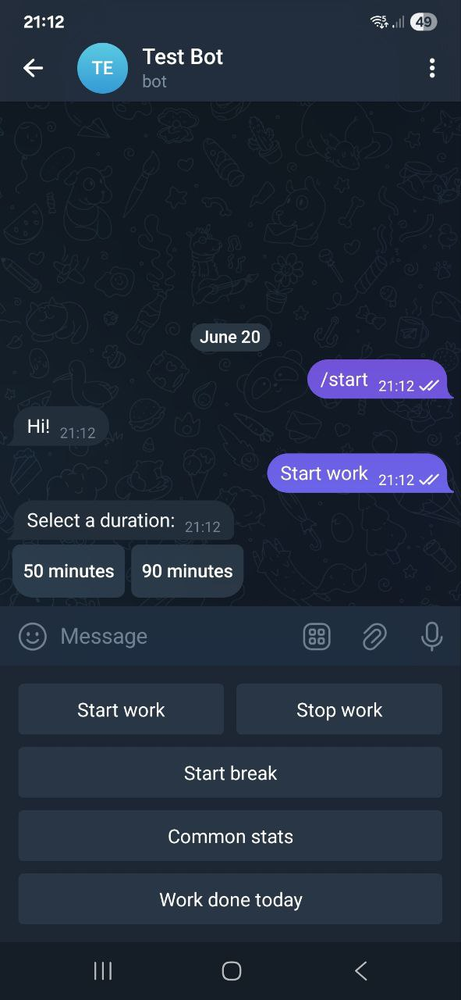

## Overview
<p align="center">
  
  
  
  
  <br/>
  <em>Figure 1: User clicks 'Start work' and choses the work duration (image 1), which sets an alarm (image 2); in 50 minutes, the alarm is triggered (image 3); after the user stops the alarm, the user can see the progress and can choose the break duration, which would also trigger an alarm to stop the break (image 4). </em>
</p>


## Tech stack
Python, Flask, SQLite, SQLAlchemy, python-telegram-bot library;

## Installing
The following instructions help you install the bot with Docker, however, without Docker, it's also possible.

```
- Create a bot using BotFather in Telegram
- Install Docker
- Run in terminal: git clone https://github.com/Frunnze/reminder-tracker-telegram-bot
- Open reminder-tracker-telegram-bot directory
- Create in that directory the file called .env
- Copy the .env.example content
- Paste the copied content into .env
- Add your Telegram bot token in your .env file.
- Run in terminal (of the same directory): docker compose up --build -d
- Access your bot in Telegram.
```